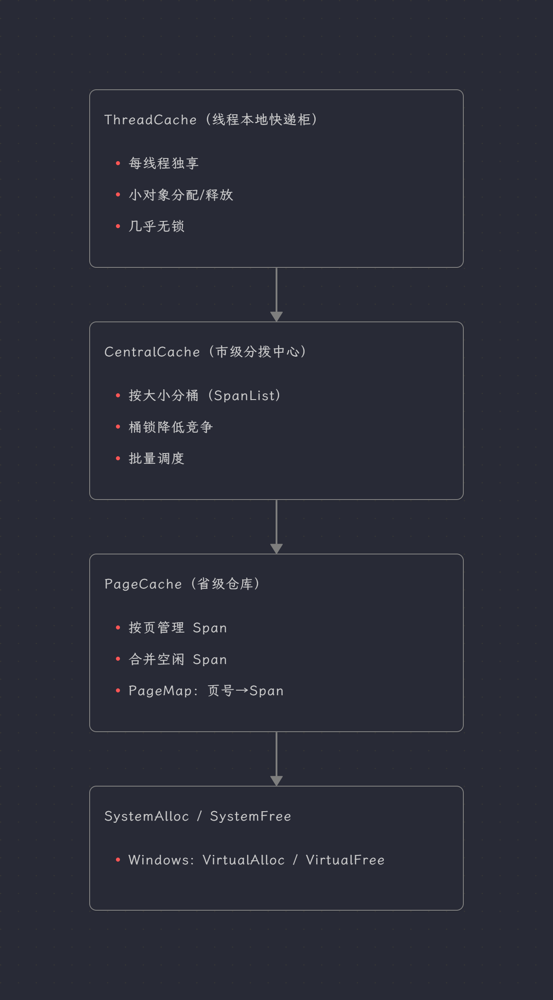

# ConcurrentMemoryPool（高并发内存池）

## 1. 项目概述

>-   这是一个基于 C++ 实现的高性能并发内存池项目，其核心设计思想参考了 Google 的开源项目 **[TCMalloc (Thread-Caching Malloc)](https://github.com/google/tcmalloc)**。
>
>-   该项目为学习/实验性质实现，用于理解 [tcmalloc](https://gitee.com/mirrors/tcmalloc) 类设计思想。

在解决在高并发多线程环境下，传统 `malloc/free` 因锁竞争会导致性能下降的问题，本项目通过精细化的内存管理减少内存碎片、提升内存利用率；同时采用 **ThreadCache (线程缓存)**、**CentralCache (中心缓存)** 和 **PageCache (页缓存)** 三级缓存架构，实现了高效的内存分配与回收。该内存池主要面向 “小对象频繁申请/释放” 的高并发场景设计，将内存分配机制打造成 “多级快递网络”，能让多线程程序在高压力下更快、更稳定地完成内存分配与回收操作。

**实现的效果：**

- 多线程下分配/释放速度显著快于系统 `malloc/free`。
- 低锁竞争，稳定性更好。
- 小对象分配几乎“秒拿秒还”。

## 2. 适用场景/业务

- 服务器高并发服务（网络、日志、消息系统）
- 游戏/渲染引擎中大量短生命周期对象
- 高频数据处理/缓存组件
- 大量小对象频繁申请与释放的业务模块

**不太适合（收益较小）：**

- 单线程、分配很少的程序
- 主要分配超大对象（> 256KB）且频率不高

---

## 3. 如何使用

对外有两个接口（在 `ConcurrentAlloc.h`）：

### 1. `void* ConcurrentAlloc(size_t size)`

- **作用**：分配 `size` 字节内存。
- **特点**：线程安全，高并发下速度快。
- **注意**：`size` 必须 > 0。
- **行为**：
  - `size <= 256KB`：走“高并发内存池”。
  - `size > 256KB`：走“页级分配”（仍由本项目管理）。

### 2. `void ConcurrentFree(void* ptr)`

- **作用**：释放由 `ConcurrentAlloc` 分配的内存。
- **注意**：必须传入原始指针，不能重复释放！

### 3. 使用示例

#### 示例 1：基础使用

```cpp
#include "ConcurrentAlloc.h"
#include <iostream>

int main()
{
    void* p1 = ConcurrentAlloc(32);
    void* p2 = ConcurrentAlloc(128);
    void* p3 = ConcurrentAlloc(1024);

    std::cout << p1 << "\n" << p2 << "\n" << p3 << std::endl;

    ConcurrentFree(p1);
    ConcurrentFree(p2);
    ConcurrentFree(p3);
    return 0;
}
```

#### 示例 2：多线程高并发分配/释放

```cpp
#include "ConcurrentAlloc.h"
#include <vector>
#include <thread>

void Worker(size_t ntimes)
{
    std::vector<void*> v;
    v.reserve(ntimes);

    for (size_t i = 0; i < ntimes; ++i)
    {
        v.push_back(ConcurrentAlloc((i % 8192) + 1));
    }

    for (void* p : v)
    {
        ConcurrentFree(p);
    }
}

int main()
{
    const size_t threads = 4;
    const size_t ntimes = 50000;

    std::vector<std::thread> ts;
    for (size_t i = 0; i < threads; ++i)
    {
        ts.emplace_back(Worker, ntimes);
    }

    for (auto& t : ts)
    {
        t.join();
    }

    return 0;
}
```

---

## 4. 项目设计思路 & 工作原理



把内存分配想成快递体系：

- **全国只有一个总仓库**（系统堆/VirtualAlloc） → 远、慢，但货全。
- **每个省有省级仓库**（PageCache） → 管理大块内存、还能合并空闲。
- **每个市有分拨中心**（CentralCache） → 按“包裹大小”分桶管理。
- **每个小区有快递柜**（ThreadCache） → 每个线程专属，拿货几乎不排队。

这样做的结果是：
- 线程想要内存时，大多数时候只在“本地快递柜”拿 → **快**。
- 快递柜没货，就从市级分拨中心“批量补货” → **减少排队**。
- 分拨中心缺货，再向省仓要整批货 → **降低系统调用次数**。

这就是它比 `malloc/free` 快得多的原因。

>### 1. 内存分配策略
>
>**小对象（<= 256KB）：**
>
>1. 先把大小做对齐（8 字节、16 字节…）。
>2. 在当前线程的 ThreadCache 中找对应 FreeList。
>3. 有就直接拿（无锁）。
>4. 没有就向 CentralCache 批量申请（桶锁）。
>5. CentralCache 也没有，再向 PageCache 要一段大块内存，切割后返回。
>
>**大对象（> 256KB）：**
>
>1. 直接向 PageCache 申请。
>2. PageCache 计算页数，若无合适 Span 则向系统申请。
>
>### 2. 内存回收策略
>
>- **ThreadCache 回收**：对象先回到本线程 FreeList。
>- **CentralCache 回收**：当 ThreadCache 过长时，把一部分还回中心。
>- **PageCache 回收**：当一个 Span 全部归还后，再回 PageCache；并尝试和前后空闲 Span 合并。
>
>### 3. 细节
>
>- **对齐策略（SizeClass）**：把大小对齐到 8/16/128/1K/8K 等，减少碎片。
>- **ObjectPool（定长对象池）**：专门用于 `Span` 等元数据，避免频繁 `new`。
>- **PageMap**：存储“页号 → Span”的映射，支持快速定位与合并。
>    - 32 位使用单层数组。
>    - 64 位使用多层基数树（更省内存，也能覆盖更大地址空间）。

## 5. 目录结构（源码）

- `Common.h`：对齐/桶索引规则、FreeList、Span、SpanList。
- `ThreadCache.h/.cpp`：线程本地缓存。
- `CentralCache.h/.cpp`：中心缓存。
- `PageCache.h/.cpp`：页缓存与合并逻辑。
- `PageMap.h`：页号 → Span 映射。
- `ObjectPool.h`：Span/辅助结构对象池。
- `ConcurrentAlloc.h`：对外分配/释放接口。
- `Benchmark.cpp`：性能基准。
- `UnitTest.cpp`：扩展测试入口（可选）。

## 6. 为什么能达到高并发效果？

1. **线程本地缓存**：每个线程几乎不用锁就能分配/释放。
2. **批量调度**：一次申请/归还多块，减少锁竞争次数。
3. **大小分桶 + 对齐**：减少碎片，提高命中率。
4. **页级管理**：大块内存按页分配，并支持合并相邻空闲 span。

## 7. 项目核心与特色

- **三层缓存结构**：ThreadCache / CentralCache / PageCache。
- **按大小分桶 + 对齐策略**：减少浪费，提升分配效率。
- **慢启动批量策略**：常用大小会自动增加批量，提高吞吐。
- **页级映射与合并**：提高回收效率，降低碎片。
- **统一接口**：`ConcurrentAlloc / ConcurrentFree`，替换成本低。

>### 1. ThreadCache（线程缓存）
>
>- **功能**：每个线程独享，用于小于 256KB 的分配与回收。
>- **特点**：基于线程局部存储，所以 **大多数操作无锁**。
>- **实现**：内部维护 `FreeList` 数组，小对象按大小映射到不同链表。
>
>### 2. CentralCache（中心缓存）
>
>- **功能**：所有线程共享，连接 ThreadCache 与 PageCache。
>- **特点**：谁缺货就从这里批量拿，谁多了就批量还回来。
>- **实现**：用 **Span** 管理内存，用 **桶锁** 保护不同大小的 SpanList。
>
>### 3. PageCache（页缓存）
>
>- **功能**：按页管理大块内存，直接与 OS 交互。
>- **特点**：负责切分/回收/合并，缓解碎片。
>- **实现**：全局锁保护；使用 **PageMap** 做页号 →Span 映射。

## 8. 平台与限制

- **Windows x86/x64 已实现**（使用 `VirtualAlloc/VirtualFree`）。
- **Linux 暂未实现**（已预留接口）。
- `size == 0` 未定义行为（建议在调用侧避免）。
